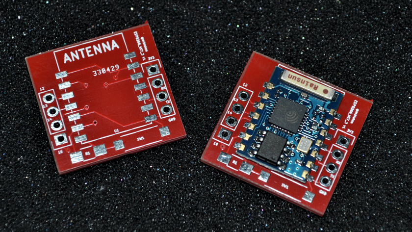

# ESP8266 Wi07-3 SMD adapter

A very minimal SMD adapter for the [ESP8266 Wi07-3](http://www.electrodragon.com/product/esp8266-wifi-board-full-ios-smd/). The components can be found in my [Kicad library](https://github.com/mbialon/kicad).

## Schematic

## PCB layout

## Manufactured board

